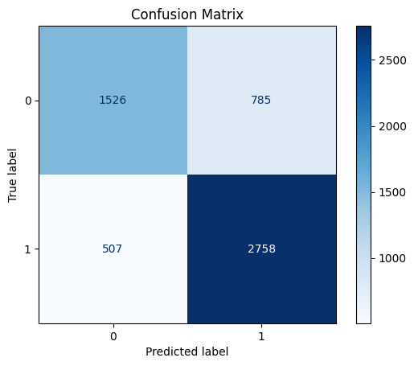
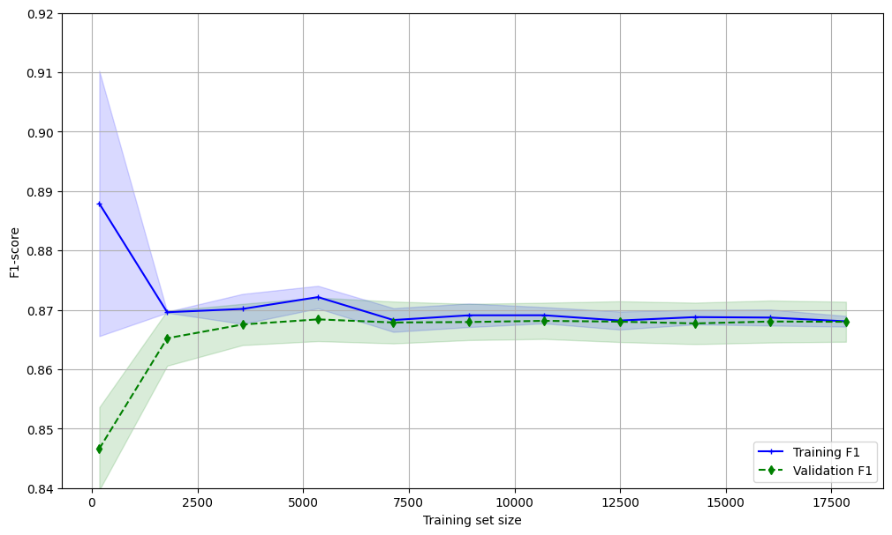
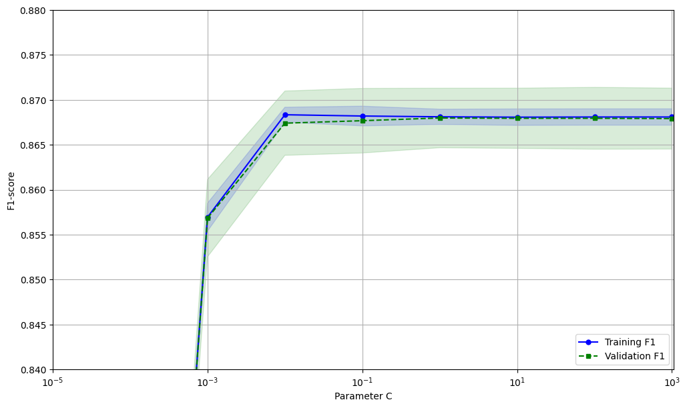

# Student Depression Prediction Using Machine Learning


A binary classification project predicting student depression based on lifestyle, demographic, academic, and psychological indicators. Developed as part of the Machine Learning Module 1 (2024/2025) for the Bachelor in Artificial Intelligence at the University of Pavia (UNIPV).

<p align="center">
  
  
</p>

## 🎯 Project Overview

Depression among students is a growing concern in academic environments. This project employs machine learning techniques to identify patterns that contribute to student depression, enabling early detection and intervention.

**Objective:** Build a robust binary classification model capable of predicting whether a student is experiencing depression (1) or not (0).

### 🏆 Key Achievements

- **F1 Score:** 87%+ on test set
- **Systematic approach** with nested cross-validation
- **Real-world simulation** with controlled missing data
- **Comprehensive preprocessing** pipeline for diverse feature types

## 📊 Dataset

**Source:** [Student Depression Dataset – Kaggle](https://www.kaggle.com/datasets/hopesb/student-depression-dataset)

The dataset contains responses from students across multiple dimensions:

### Features
- **Demographics:** Age, Gender, City, Degree
- **Academic:** CGPA, Academic Pressure, Study Satisfaction, Work/Study Hours
- **Lifestyle:** Sleep Duration, Dietary Habits, Physical Activity
- **Psychological:** Suicidal Thoughts, Family History of Mental Illness, Financial Stress

### Target Variable
- **Depression:** Binary classification (0 = No, 1 = Yes)

### Dataset Statistics
- **Total Samples:** 481 students
- **Features:** 13 (after preprocessing)
- **Class Distribution:** Slightly imbalanced (addressed with SMOTE)

## 🔧 Methodology

### 1. Data Preprocessing

**Feature Engineering:**
- Renamed columns for better readability
- Removed irrelevant features: `id`, `Profession`, `Work Pressure`, `Job Satisfaction`
- Consolidated high-cardinality categorical variables:
  - **Degree:** Grouped into Pre-University, Undergraduate, Postgraduate, PhD
  - **City:** Categorized into Major Metropolitan, Industrial/Commercial, Suburban, Other

**Missing Data Handling:**
- Intentionally introduced 10% missing values to simulate real-world scenarios
- Treated infrequent 'Others' categories as missing data
- Dropped rows with missing values in `Financial Stress` and `Sleep Duration` (minimal impact)
- Applied imputation strategies for remaining missing data

### 2. Feature Transformation Pipeline

Created specialized pipelines for different feature types:

| Feature Type | Transformation | Applied To |
|--------------|----------------|------------|
| Numerical | Standard Scaling | Age, CGPA, Academic Pressure, etc. |
| Binary Categorical | One-Hot Encoding | Suicidal Thoughts, Family History |
| Ordinal | Ordinal Encoding + Scaling | Sleep Duration, Dietary Habits |
| Nominal Categorical | Imputation + One-Hot Encoding | Gender, City, Degree |

### 3. Model Selection & Optimization

**Approach:** Nested Cross-Validation with Randomized Search

**Explored Components:**

#### Sampling Techniques
- None (baseline)
- SMOTE (Synthetic Minority Over-sampling)
- RandomOverSampler

#### Dimensionality Reduction
- None
- PCA (Principal Component Analysis)
- LDA (Linear Discriminant Analysis)
- Sequential Feature Selection

#### Classifiers
- Perceptron
- **Logistic Regression** (L1/L2 regularization) ⭐ **Selected**
- Random Forest
- XGBoost

**Hyperparameter Search:**
- Initial broad search: ~500+ configurations
- 2-fold CV for initial screening
- 5-fold CV for final evaluation
- Refined search around best-performing model
- F1 score as primary evaluation metric

### 4. Final Model

**Selected Architecture:**
```python
Pipeline:
├── Feature Transformation (ColumnTransformer)
│   ├── Numerical Features → StandardScaler
│   ├── Categorical Features → OneHotEncoder
│   └── Ordinal Features → OrdinalEncoder + StandardScaler
│
└── Logistic Regression
    ├── Penalty: L1 (Lasso)
    ├── Solver: saga
    └── C (Regularization): ~10 (optimized)
```

## 📈 Results

### Model Performance

| Metric | Test Set Score | Description |
|--------|----------------|-------------|
| **F1 Score** | **0.87+** | Harmonic mean of precision and recall |
| **Accuracy** | **0.87+** | Overall correctness |
| **Precision** | **0.87+** | True positives / Predicted positives |
| **Recall** | **0.87+** | True positives / Actual positives |

### Performance Visualization

<p align="center">
  
</p>

### Key Insights

**Learning Curve Analysis:**
- Model shows good convergence with increasing training data
- Minimal gap between training and validation scores indicates low overfitting
- Performance stabilizes around 60-70% of training data
- Training F1: ~0.90, Validation F1: ~0.87

**Validation Curve Analysis:**
- Optimal regularization strength (C) identified in range [5, 15]
- Model robust to hyperparameter variations within this range
- Clear plateau indicating good generalization

**Confusion Matrix Insights:**
- Balanced performance across both classes
- Low false positive and false negative rates
- Effective handling of class imbalance

## 🚀 Installation & Usage

### Prerequisites
```bash
Python 3.8 or higher
```

### Quick Start

1. **Clone the repository:**
```bash
git clone https://github.com/pdmdp/student-depression-project.git
cd student-depression-project
```

2. **Install dependencies:**
```bash
pip install -r requirements.txt
```

Or run the provided installer:
```bash
python Init.py
```

3. **Download the dataset:**
- Visit [Kaggle Dataset](https://www.kaggle.com/datasets/hopesb/student-depression-dataset)
- Download `StudentDepressionDataset.csv`
- Place it in the `/work/` directory

4. **Run the notebook:**
```bash
jupyter notebook MLProjectDiPilato.ipynb
```

### Alternative: Google Colab

[](https://colab.research.google.com/drive/1x3HEL5WgUOLF8_c6oeV3ptx37Nws-WXI)

## 📁 Project Structure

```
student-depression-project/
│
├── MLProjectDiPilato.ipynb       # Main analysis notebook
├── Init.py                        # Dependency installer
├── requirements.txt               # Python dependencies
├── StudentDepressionDataset.csv   # Dataset (add to /work/)
├── README.md                      # Project documentation
│
└── images/                        # Visualizations (optional)
    ├── confusion_matrix.png
    ├── learning_curve.png
    └── validation_curve.png
```

## 🔍 Key Features

✅ **Real-world data simulation** with controlled missing values  
✅ **Comprehensive preprocessing pipeline** handling diverse feature types  
✅ **Systematic model selection** via nested cross-validation  
✅ **Class imbalance handling** with SMOTE and class weighting  
✅ **Hyperparameter optimization** with RandomizedSearchCV (500+ configurations)  
✅ **Robust evaluation** using multiple metrics and visualization  
✅ **Reproducible results** with fixed random seeds

## 🧪 Technical Highlights

### Preprocessing Innovation
- Custom `ColumnTransformer` with specialized pipelines for each feature type
- Intelligent handling of high-cardinality categorical variables
- Strategic treatment of missing data based on feature characteristics

### Model Selection Process
- Explored 4 different classifiers
- Tested 3 sampling techniques
- Evaluated 4 dimensionality reduction methods
- Total configurations evaluated: 500+

### Validation Strategy
- Nested cross-validation for unbiased performance estimation
- Stratified K-Fold to maintain class distribution
- Multiple performance metrics for comprehensive evaluation

## 🎓 Academic Context

This project demonstrates proficiency in:
- End-to-end machine learning pipeline development
- Advanced preprocessing techniques for mixed data types
- Model selection and hyperparameter tuning strategies
- Cross-validation and performance evaluation
- Handling imbalanced datasets
- Data visualization and interpretation

**Course:** Machine Learning Module 1  
**Academic Year:** 2024/2025  
**Institution:** University of Pavia (UNIPV)  
**Degree Program:** Bachelor in Artificial Intelligence

## ⚠️ Ethical Considerations

**Important:** This model is developed for educational purposes and demonstrates machine learning concepts. Mental health prediction requires:

- ✋ **Clinical validation** before real-world deployment
- 🔒 **Privacy protection** and informed consent
- 👨‍⚕️ **Integration with professional** mental health services
- 📊 **Awareness of model limitations** and potential biases
- 🎯 **Responsible use** as a screening tool, not diagnosis

**This model should NOT be used as a standalone diagnostic tool.**

### Limitations
- Limited dataset size (481 samples)
- Potential sampling bias (Kaggle dataset)
- Self-reported data may contain inaccuracies
- Model trained on specific demographic (may not generalize globally)
- Temporal aspects of depression not captured

## 📝 Future Improvements

### Short-term
- [ ] Implement SHAP values for feature importance and model interpretability
- [ ] Add confidence intervals and prediction probabilities
- [ ] Create interactive visualizations with Plotly
- [ ] Develop feature importance analysis

### Medium-term
- [ ] Explore ensemble methods (stacking, voting classifiers)
- [ ] Implement deep learning approaches (Neural Networks, Autoencoders)
- [ ] Collect more diverse data to improve generalization
- [ ] Add temporal features (time-series patterns)

### Long-term
- [ ] Develop web application for model deployment (Streamlit/Flask)
- [ ] Integrate with student wellness programs
- [ ] Create multi-class severity prediction (mild, moderate, severe)
- [ ] Build recommendation system for intervention strategies

## 📚 References

1. Student Depression Dataset - [Kaggle](https://www.kaggle.com/datasets/hopesb/student-depression-dataset)
2. Scikit-learn Documentation - [sklearn.org](https://scikit-learn.org/)
3. Imbalanced-learn Documentation - [imbalanced-learn.org](https://imbalanced-learn.org/)
4. SMOTE: Synthetic Minority Over-sampling Technique - Chawla et al. (2002)

## 👨‍💻 Author

**Filippo Di Pilato**  
Bachelor in Artificial Intelligence  
University of Pavia (UNIPV)  
Academic Year 2024/2025

📧 Contact: [Your email if you want to add it]  
🔗 LinkedIn: [Your LinkedIn if you want to add it]

## 📄 License

This project is developed for academic purposes as part of the Machine Learning Module 1 course at the University of Pavia.

## 🙏 Acknowledgments

- **Dataset:** Hope Barnett (Kaggle)
- **Institution:** University of Pavia, Department of Computer Engineering
- **Course Instructors:** Machine Learning Module 1 teaching team
- **Libraries:** Scikit-learn, XGBoost, Imbalanced-learn communities

---

<p align="center">
  ⭐ If you found this project helpful, please consider giving it a star!<br>
  💡 Feel free to fork and adapt for your own learning
</p>

---

**Disclaimer:** This is an educational project. The model's predictions should not be used for actual medical diagnosis or treatment decisions.


